# **LAB REPORT 1: Remote Access and the File System**

Welcome to a tutorial regarding remote access anad the filesystem. 

## **STEP 1: Installing Visual Studio Code (VSCode) and OpenSSH (situational)**

If you are on a Windows device, then you must install a progam called [OpenSSH](https://docs.microsoft.com/en-us/windows-server/administration/openssh/openssh_install_firstuse). Otherwise, skip this first step.

To start, follow the link to the VSCode website: [https://code.visualstudio.com/](https://code.visualstudio.com/) to download the version that matches your operating system. After the installation has finished, click on the the icon to open a page similar to this: 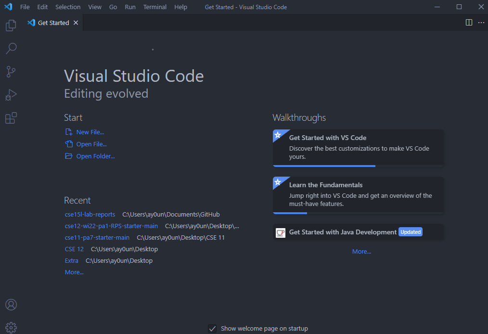

## **STEP 2: Remotely Connecting**

Begin by looking up your course respective ieng6 account using this [link](https://sdacs.ucsd.edu/~icc/index.php). The account should look something like this: `cs15lwi22xyz@ieng6.ucsd.edu` (with `xyz` replaced with your account's letters.) You will need to reset your password in order to activate and access your account.  

In VSCode, open a terminal by locating it at the menu option and clicking "New Terminal."   

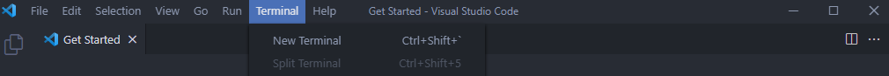 

In the terminal, run the following command: `ssh cs15lwi22xyz@ieng6.ucsd.edu` to prompt the following message: 

```
ssh cs15lwi22xyz@ieng6.ucsd.edu
The authenticity of host 'ieng6.ucsd.edu (128.54.70.227)' can't be established.
RSA key fingerprint is SHA256:ksruYwhnYH+sySHnHAtLUHngrPEyZTDl/1x99wUQcec.
Are you sure you want to continue connecting (yes/no/[fingerprint])? 
```

Don't be afraid if you see this message. It is expected to pop up when connecting to servers for the first time. Type `yes`, press enter, and type in your password. After logging in successfully, the following messages should be received: 

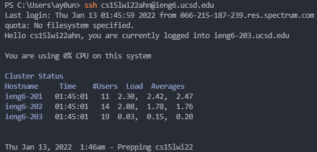. 

Congragulations, you have successfully connected your computer's terminal (client) to a remote computer! (server).

## **STEP 3: Trying Some Commands**

Below is a compiled list of useful commands to try in your terminal: 

**some file commands**
* `ls` - directory listing
* `ls -al` - formatted listing with hidden files
* `cd dir` - changes directory to *dir*
* `cd` changes directory to home
* `pwd` - shows current directory 
* `mkdir dir` - creates a directory *dir*
* `exit` or crtl + D - logs out of the remote server

**commands to observe**
* `ls cat /home/linux/ieng6/cs15lwi22/public/hello.txt` 
* `cp /home/linux/ieng6/cs15lwi22/public/hello.txt ~`

**Some examples of running these commands are:** 

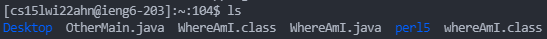

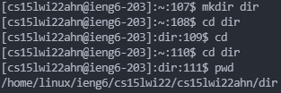

## **STEP 4: Moving Files over SSH with scp**

The command `scp`, which is always run from the client, copies files from your computer to a remote computer.

---
We begin by creating a file called `WhereAmI.java` which has the following contents: 

```
class WhereAmI 
{
  public static void main(String[] args) 
  {
    System.out.println(System.getProperty("os.name"));
    System.out.println(System.getProperty("user.name"));
    System.out.println(System.getProperty("user.home"));
    System.out.println(System.getProperty("user.dir"));
  }
}
```

Run the following command in the file's directory:  `$ scp WhereAmI.java cs15lwi22xyz@ieng6.ucsd.edu:~/` and then `javac` and `java`

**The following image should be similar to what your terminal displays:** 

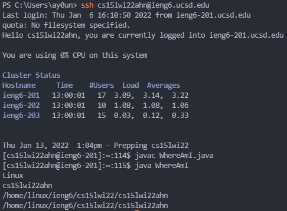

## **STEP 5: Setting an SSH Key**

In this step, we will use `ssh` keys to use the file pair *public key* and *private key* using a program called `ssh-keygen` in place of entering our password to verify the authenticity of the host. 

---
***What* is SSH?**

SSH or Secure Shell is a service that that allows you to modify their remote servers from the internet. It's primary execution involves remotely logging in and command-line execution. 

**Setting up SSH Keys**
1. On the client, type the command `ssh-keygen`.
2. Enter a file to save the key (or simply press Enter). 
3. Enter a passphrase (or simply press Enter). Enter the passphrase again.
4. If on Windows, follow these [extra steps](https://docs.microsoft.com/en-us/windows-server/administration/openssh/openssh_keymanagement#user-key-generation). Specify the full path of the keys as shown above. Make a `.ssh` folder using the command `mkdir ssh` and log out.

**The whole process should look something like this:**

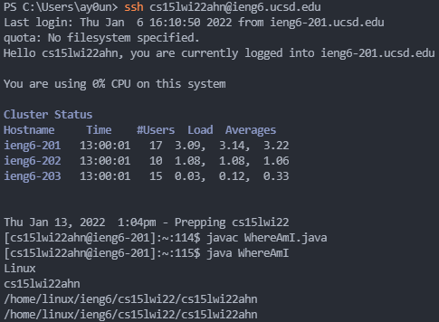

**If on Windows the additional steps:** 

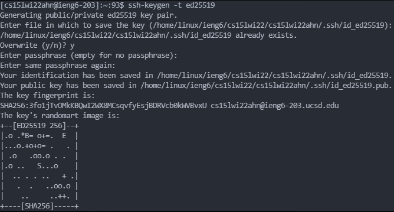

**Copying the *public* key to the `ssh` directory**

The public key is the file with the `.pub` extension. Use the `scp` command to copy the `id_rsa.pub` to the authorized keys_keys folder. 

**As instructed from above:** 

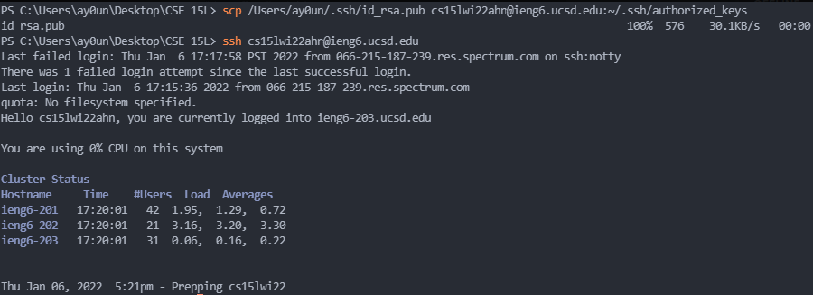

## **STEP 6: Optimizing Remote Running**

As you become more familiar with remote running, efficiency becomes the next step in your coding journey. 

Some things you can do to save time is adding semicolons to run multiple commands on the same line, such as: 

`$ cp WhereAmI.java OtherMain.java; javac OtherMain.java; java WhereAmI`

**An example of this is:** 

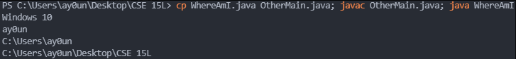

And using your arrow keys in the terminal to access your most recent commands!

Finally, we can also copy a file from our local client to the server. Like above, we can do this in one line by typing: 

`scp Hello.java cs15lwi22xxx@ieng6.ucsd.edu:~/; ssh cs15lwi22xxx@ieng6.ucsd.edu "javac Hello.java; java Hello"`

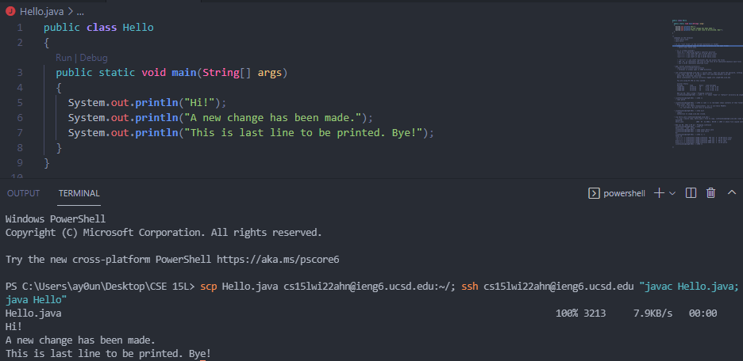

As seen from above, this would save us an immense amount of time. If we were to type each command line by line, it would take many, many keystrokes. Utilizing arrow keys, enter, and ";" for the commands, we can type the command shown in the above figure in around 10 keystrokes as opposed to 20+!

## Conclusion

So that's it. The basics of remote running and filesystems. Good luck!

## Sources
“How Does SSH Work.” *Hostinger Tutorials*, 12 Jan. 2022, www.hostinger.com/tutorials/ssh-tutorial-how-does-ssh-work.
