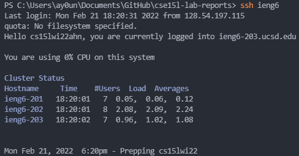

# **LAB REPORT 3: "It Works on my Machine"**

Setting up the `ssh` command in ieng6 more efficiently. 

## **Step 1: ~/.ssh/config**

We locate our file named `/.ssh/config` to create a username for our ieng6 accounts when logging in. 

To find where `~/.ssh/config` is located, we locate it through our file explorer by typing: `/Users/(computerusername)\~\.ssh\config/` as seen in this image: 

 

or by typing the command `code ~/.ssh/config` in command prompt: 

 

From here, we can use VSCode to modify the file `config` to type in the following: 

```
Host ieng6
    Host ieng6
    HostName ieng6.ucsd.edu
    User cs15lwi22ahn 
```



We can now use the command `ssh ieng6` to use the key to log you in with the username specified from the public key. 