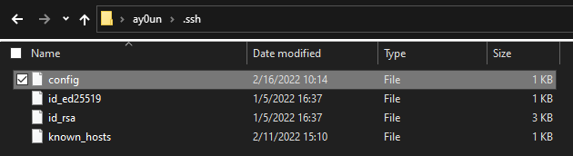
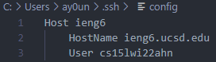
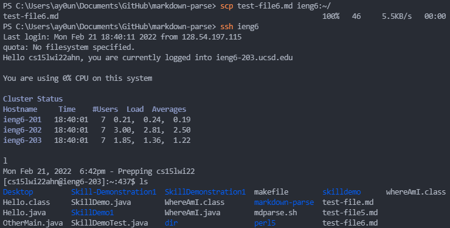

# **LAB REPORT 3: "It Works on my Machine"**

Setting up the `ssh` command in ieng6 more efficiently. 

## **Step 1: `~/.ssh/config`**

We locate our file named `/.ssh/config` to create a username for our ieng6 accounts when logging in. 

To find where `~/.ssh/config` is located, we locate it through our file explorer by typing: `/Users/(computerusername).ssh\config/` as seen in this image: 

 

From here, we can use VSCode to modify the file `config` to type in the following: 

```
Host ieng6
    HostName ieng6.ucsd.edu
    User cs15lwi22ahn 
```

## **Step 2: Using the `ssh` Command with Alias**



We can now use the command `ssh ieng6` to use the key to log you in with the username specified from the public key. 


From this image, we can see how easily we are able to login!

## **Step 3: Using the `scp` Command with Alias**

I first created a new file in in `markdown-parse` and after committing and pushing it to GitHub, I logged into the server. 


In the image above, we can see that `test-file6.md` does not exist yet. 

After using the `scp` command, as see in this image: 



I used the `ls` command to see if copying the file to `ieng6` was successful. 

Look at all the saved time and energy!