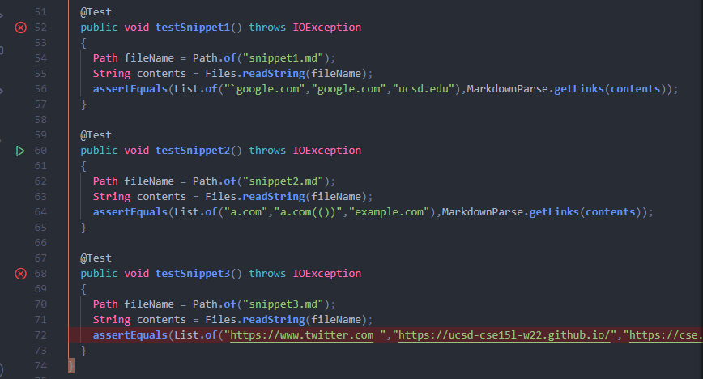
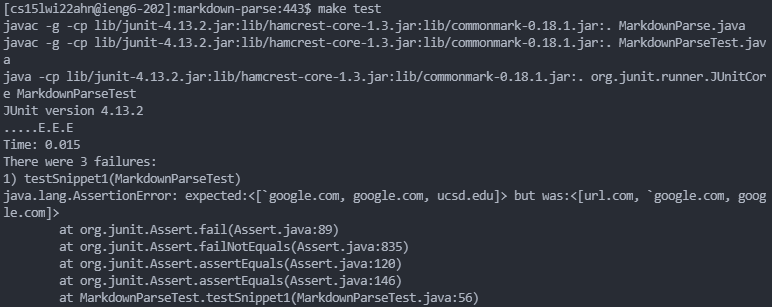
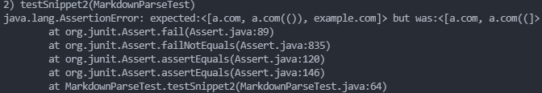
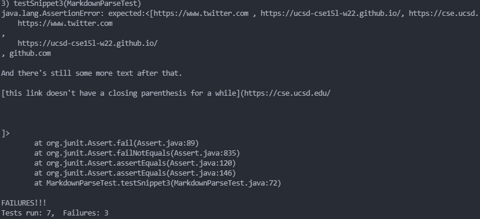
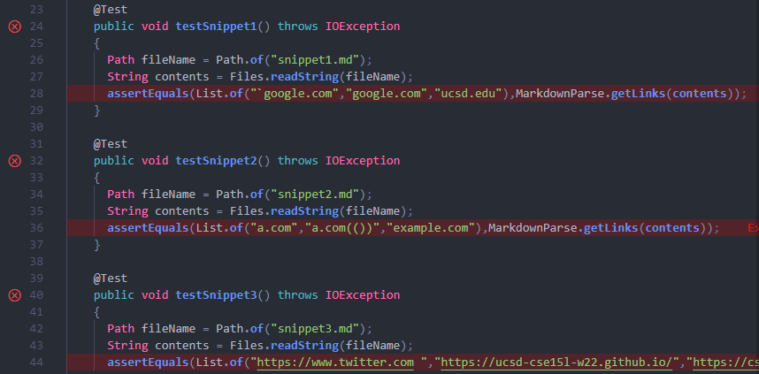
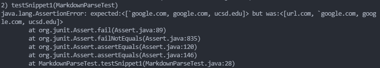
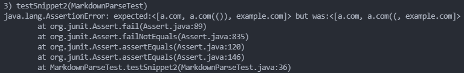
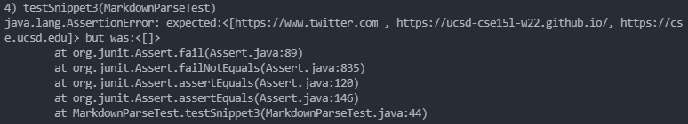

# **LAB REPORT 4: "Debugging and Code Review"**

## **Repository Links**
[My Repository](https://github.com/ayoung001/markdown-parse)

[Reviewed Repository](https://github.com/AchuthKrishna/markdown-parse)

## **My Implementation with Code Snippets**

Using the VSCode preview, I found which texts were considered links and which were not. 

Below is how I turned each of the snippets into tests: 

From the above image, you can see that the expected output does not match the actual output. 

For snippet 1, the expected vs. actual output is as seen below:

The test did not pass, and it contained `url.com` which is not considered a link and did not contain `ucsd.edu` despite being a link. 

For snippet 2, the expected vs. actual output is as seen below: 

The test did not pass, and it contained `a.com((` instead of `a.com(())` and did not include `example.com` despite being a link.

For snipped 3, the expected vs. actual output is as seen below: 

The test did not pass, and it contained text that should not be included in the output. 

## **Review Implementation with Code Snippets**

Doing the same thing that I did above, here are the tests that I made for the code snippets: 

For snippet 1, the expected vs. actual output is as seen below: 

For snippet 2, the expected vs. actual ouput is as seen below: 

For snipped 3, the expected vs. actual output is as seen below: 

## **Answer to Questions**

1. **Do you think there is a small (<10 lines) code change that will make your program work for snippet 1 and all related cases that use inline code with backticks? If yes, describe the code change. If not, describe why it would be a more involved change.**

    In the first code snippet there should be a way to change the code so that it keeps track of backticks and brackets in the code. From the last example in snippet 1, we can see that inline code can be present within the brackets and still count as a link and if we are able to perhaps use a stack, then it shouldn't be too difficult to achieve. 

2. **Do you think there is a small (<10 lines) code change that will make your program work for snippet 2 and all related cases that nest parentheses, brackets, and escaped brackets? If yes, describe the code change. If not, describe why it would be a more involved change.**

    In the second code snippet, we should once again be keeping track of brackets and any strings that may appear in the brackets. I think we can use Java's built-in stack to keep track of all the parentheses and brackets within the code. 

3. **Do you think there is a small (<10 lines) code change that will make your program work for snippet 3 and all related cases that have newlines in brackets and parentheses? If yes, describe the code change. If not, describe why it would be a more involved change.**

    In the third code snippet. I think we can do the same thing as we did in the previous examples by keeping track of all the parentheses or brackets that appear. For text that appears within the brackets, might take a bit more code as we have to ensure that it does not appear in the output. 

