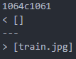
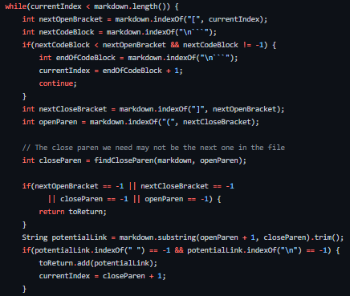
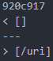
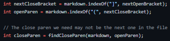

# **LAB REPORT 5: "Using a Script to Run Many Files"**

## **Step 1: Different Results, Same Test**

I used the command `diff` on the `test-results` file for `your-markdown-parse` and `markdown-parse`. 

The specific command I ran was: 

`diff your-markdown-parse/markdown-parse/results.txt markdown-parse/results.txt > more-results.txt`

which piped the results from the diff into a new text file. 

Inside the file, the following results were found: 

```
< []
< []
---
> [/uri]
920c917
< []
---
> [/uri]
922c919
< []
---
> [/uri]
1042c1039
< [not a link]
---
> []
< []
---
> [/url]
1064c1061
< []
---
> [train.jpg]
---
211c211
211c211
< []                                                                                                                       t
---
> [url]
229c229
< []
---
> [baz]
269c269
< [/bar\* "ti\*tle"]
---
> []
491c491
< [/f&ouml;&ouml; "f&ouml;&ouml;"]
---
> []
691c691
< [url &quot;tit&quot;]
---
> []
849c849
< [/uri "title"]
---
> []
861c861
< [/my uri]
---
> []
```

## **Step 2: Two Different Answers**

For `576.md`, the implementation that I cloned was correct while our implementation was wrong. As seen in the image: 



my implementation, which is on top, printed out nothing while the cloned `markdown-parse` printed out the correct result. The bug in my `markdown-parse` is that I did not correctly check for links in markdown for links after colons. 



As for the code that should be changed, I would just have to add another if statement somewhere within the while loop that checks for colons.

For `510.md`, the implementation that I cloned was incorrect while our implementation was right. As seen in the image: 



The cloned implementation, which had the result `[/uri]` is incorrect and should print out nothing because in the original test, there is a space between the bracket and parentheses. 

The code that should be fixed is: 



We need to test whether there is a space between the "]" and "(". In order to be a link, there shouldn't be a space between the closing bracket and open parentheses. 

