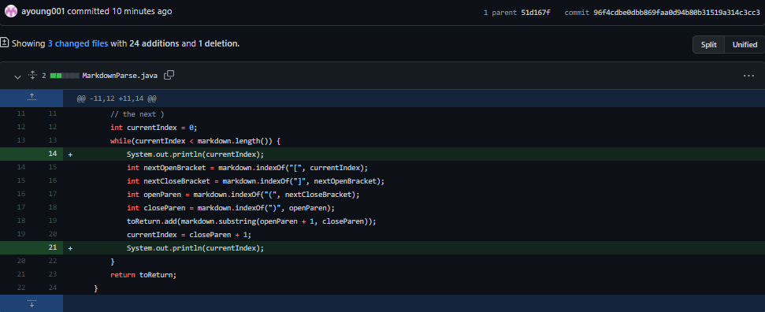
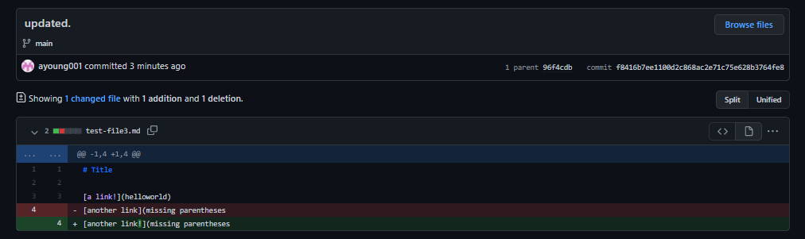
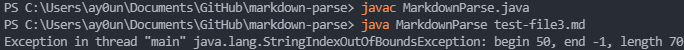
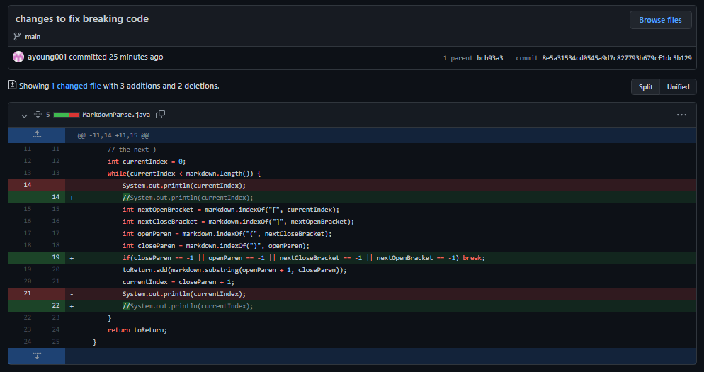
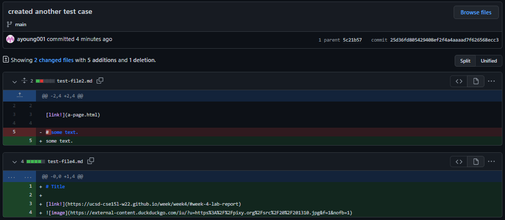
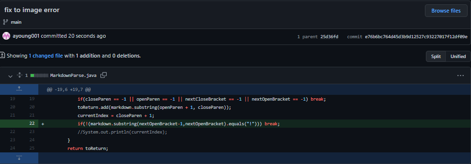

# **LAB REPORT 2: Bugs and Symptoms**

Fixing the bugs and symptoms that appear in the code.

## **Text After the Last Link**

In this test file, a bug appeared after running the command: `java MarkdownParse test-file2.md`. 

The following symptom took around 30 seconds to appear, resulting in the exception: 

```
Exception in thread "main" java.lang.OutOfMemoryError: Java heap space
        at java.base/java.util.Arrays.copyOf(Arrays.java:3512)   
        at java.base/java.util.Arrays.copyOf(Arrays.java:3481)   
        at java.base/java.util.ArrayList.grow(ArrayList.java:237)
        at java.base/java.util.ArrayList.grow(ArrayList.java:244)
        at java.base/java.util.ArrayList.add(ArrayList.java:454)
        at java.base/java.util.ArrayList.add(ArrayList.java:467)
        at MarkdownParse.getLinks(MarkdownParse.java:20)
        at MarkdownParse.main(MarkdownParse.java:29)
```

As seen from above, because `currentIndex` had not reached its final character, the program kept looking for more links and an infinite loop occured since currentIndex would keep going back to the beginning. The program kept adding more and more links which eventually resulted into an `OutOfMemoryError`. 

By having text after the last link as seen in this [test file](https://github.com/ayoung001/markdown-parse/commit/a4747e2bb74e7618c8386db8e74ffa832329d9cc#diff-c1ee2d48f5f64b4463a98907818b5846f49cc9dd67f88882a8b551106ec320fb), currentIndex is never able to reach the last character and the program is only able to stop by the user's interference or the computer running out of memory to store everything. 

## **Missing Parentheses or Brackets**

Images below: 
 


The [link](https://github.com/ayoung001/markdown-parse/commit/f8416b7ee1100d2c868ac2e71c75e628b3764fe8#diff-72d0164ca2d60c8d0fdc3b1a93d3e1a746eb8532639f111eda62faf046aa6f92) to the test file that failed shows this image: 

. 

As you can see, after running the command `java MarkdownParse test-file3.md` the symptom was an IndexOutOfBoundsException.

In the image containing the contents of the file depicts a link that is missing a parentheses. The program could not find the matching parentheses of '(' and ran into an exception because it reached the end of the file without finding it. 

To fix the above two bugs, I added a conditional if statement: 


This if statement would stop the program immediately if it could not find anymore parentheses or brackets.

## **An Image Reference**



In this [file](https://github.com/ayoung001/markdown-parse/commit/25d36fd805429408ef2f4a4aaaad7f626568ecc3#diff-8b79fb9106da4293b8fbbe72b2e0ccabcd0fa4ed999cedb59be79e4f2b3f9674), the image in this test file is printed out. While the program does not produce an error statement, when running the command `java MarkdownParse test-file4.md`, the program prints out the image of the link as well as the website: 

```
[https://ucsd-cse15l-w22.github.io/week/week4/#week-4-lab-report, https://external-content.duckduckgo.com/iu/?u=https%3A%2F%2Fpixy.or/?u=https%3A%2F%2Fpixy.org%2Fsrc%2F20%2F201310.jpg&f=1&nofb=1]
```
The image link also appears in the output because the program does not check to see if the contents within the parentheses contains an image link or a site link. This problem is caused by a lack of differentiation between the two, where images would contain the character `!` before the bracket and links would contain the character `!` inside the bracket. 

To fix the program, I merely added another conditional statement checking to see if this character was contained: 


